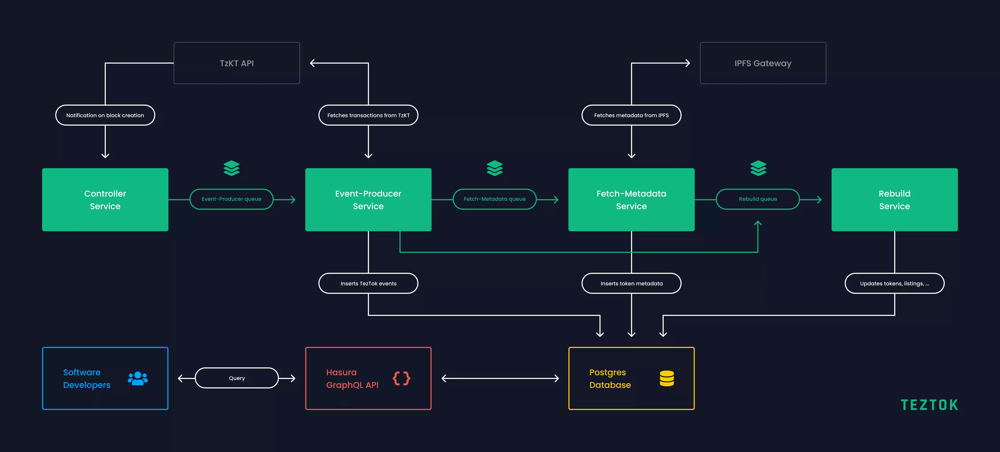

# Architecture

The indexer is built on a service-based architecture. Services are connected to each other through queues. All services are connected to a Postgres database, which is used to store the indexed data and also acts as the backend of the queuing system. Here is a diagram that visualizes the architecture of the indexer:

## Controller Service

The controller service subscribes to the TzKt WebSocket API and gets notified every time a new block is created. When that happens, it adds a new job to the event-producer queue signaling the TezTok system that there is a new block that needs to be processed.

---

## Event-Producer Service

The event producer service handles the jobs from the event-producer queue. There is one job per block. This is how the event producer processes a block:

1. All transactions and originations of a block get fetched from the TzKT API.
2. The transactions and originations get passed to handlers where they get filtered and turned into TezTok events.
3. TezTok events get stored in the Postgres Database.
4. The service then loops over every newly created TezTok event. If it's an event that is related to a token (for example a mint event or a swap event) a job is added to the rebuild-queue, which will then update the token model. If it's a metadata-related event, a job is added to the fetch metadata queue, which will download the metadata from IPFS.

---

## Rebuild Service

The purpose of the rebuild service is to update data models. It processes the jobs from the rebuild-queue. For Example: Once a sale of a token happens, the event producer service will first create a TezTok event that reflects that sale. After that, it will create a rebuild job for the token. The rebuild service then fetches all TezTok events related to that token in chronological order and then re-creates any data models associated with that token. This includes the token model itself, listings, tags, royalty receivers, offers, and holdings.

---

## Fetch-Metadata Service

The fetch-metadata service is responsible for fetching token metadata from IPFS. It receives its jobs from the fetch-metadata queue. After fetching metadata, it adds jobs to the rebuild queue that will re-create the tokens where the metadata is used.

---

## Hasura GraphQL API

The indexer uses Hasura to provide a GraphQL API. Read more about Hasura [here](https://hasura.io/).

## Navigation

- [← Installation](installation.md)
- [Principles →](principles.md)
